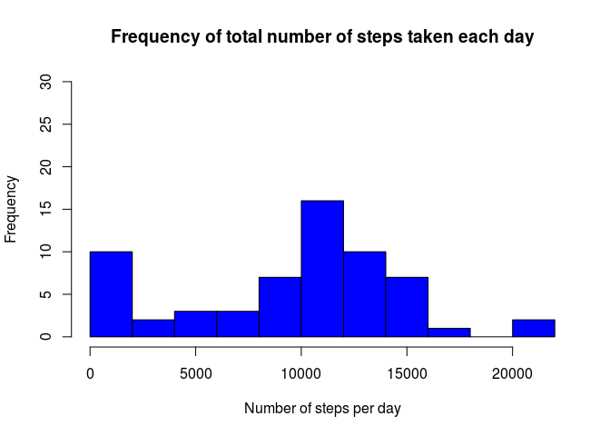
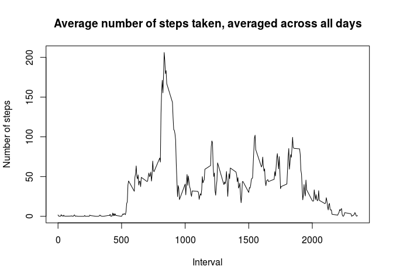
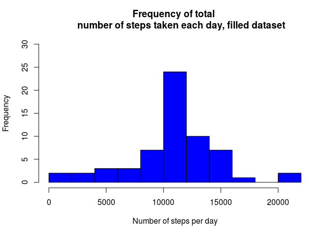
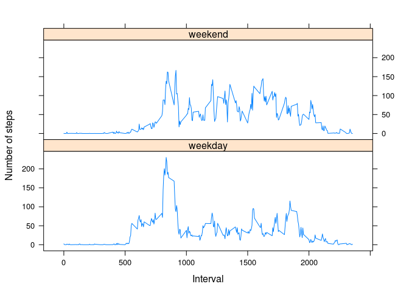

# Reproducible Research: Peer Assessment 1


## Loading and preprocessing the data
This assignment makes use of data from a personal activity monitoring device. 
This device collects data at 5-minute intervals throughout the day. The data 
consists of two months of data from an anonymous individual collected during the months of October and November, 2012 and include the number of steps taken in 5 minute intervals each day.

We first load the packages we will need later in the analysis:

```r
library(dplyr)
```

```
## 
## Attaching package: 'dplyr'
```

```
## The following objects are masked from 'package:stats':
## 
##     filter, lag
```

```
## The following objects are masked from 'package:base':
## 
##     intersect, setdiff, setequal, union
```

```r
library(lattice)
```


We create a directory called "data" if there is no such directory yet, and we store the data for this assignment in the folder data with this R code:


```r
if(!file.exists("./data")){dir.create("./data")}
url <- "https://d396qusza40orc.cloudfront.net/repdata%2Fdata%2Factivity.zip"
setwd("./data")
temp <- tempfile()
download.file(url, temp)
unzip(temp)
setwd("./..")
```


Then the data can be read into R by the following R code:


```r
data <- read.csv("data/activity.csv")
```

Then we take a first look at the data by


```r
head(data)
```

```
##   steps       date interval
## 1    NA 2012-10-01        0
## 2    NA 2012-10-01        5
## 3    NA 2012-10-01       10
## 4    NA 2012-10-01       15
## 5    NA 2012-10-01       20
## 6    NA 2012-10-01       25
```
and 

```r
str(data)
```

```
## 'data.frame':	17568 obs. of  3 variables:
##  $ steps   : int  NA NA NA NA NA NA NA NA NA NA ...
##  $ date    : Factor w/ 61 levels "2012-10-01","2012-10-02",..: 1 1 1 1 1 1 1 1 1 1 ...
##  $ interval: int  0 5 10 15 20 25 30 35 40 45 ...
```
We notice that the variable with the name "date" is a factor variable. We decide to convert this variable into a date variable:


```r
data$date <- as.Date(data$date, "%Y-%m-%d")
```


## What is mean total number of steps taken per day?
We study the number of steps taken in 5-minute intervals. For a first idea of the data we make a histogram of the the total number of steps taken per day. We first create the dataframe "totalsteps" which contains the sum of the steps per day.


```r
totalsteps <- data %>% group_by(date) %>% summarise(steps=sum(steps, na.rm=TRUE))
```

Then the plot is created:

```r
hist(totalsteps$steps, breaks=10, col="blue", 
     main="Frequency of total number of steps taken each day", 
     xlab ="Number of steps per day", ylim=c(0,30))
```

<!-- -->

The mean of the total number of steps taken per day is calculated by

```r
meansteps <- mean(totalsteps$steps)
```

and thus equals 

```r
meansteps
```

```
## [1] 9354.23
```

The median of the total number of steps taken per day is calculated by


```r
mediansteps <- median(totalsteps$steps)
```
and equals 

```r
mediansteps
```

```
## [1] 10395
```

## What is the average daily activity pattern?
To study the average daily pattern, we make a time serie splot of the 5-minute interval (x-axis) and the average number of steps taken, averaged across all days (y-axis).

We first group the data by interval and summarise by the mean of the steps:


```r
intervaldata <- data %>% group_by(interval) %>% 
        summarise(meansteps=mean(steps, na.rm=TRUE))
```

Then we plot the time series:

```r
plot(intervaldata$interval, intervaldata$meansteps, type="l", 
     main="Average number of steps taken, averaged across all days", 
     xlab="Interval", 
     ylab="Number of steps")
```

<!-- -->

The plot shows that the maximum number of steps lies around interval 800. We obtain the exact interval by

```r
maxinterval <- intervaldata$interval[which.max(intervaldata$meansteps)]
maxinterval
```

```
## [1] 835
```

The maximum is thus found in interval 835.


## Imputing missing values
The total number of missing values is found by

```r
missing <- sum(is.na(data$steps))
missing
```

```
## [1] 2304
```

We see that there are 2,304 missing values. Recall that the total number of observations is 17,568, meaning that 13,1% of the values are missing.

We will fill the missing values by the mean value of the missing value's 5-minute interval and call the new dataset "datafilled":

```r
observations <- nrow(data)
i <- 1
datafilled <- data
for (i in 1:observations){
        if (is.na(datafilled$steps[i])==TRUE){
                interval <- datafilled$interval[i]
                row <- which(intervaldata$interval == interval)
                datafilled$steps[i] <- intervaldata$meansteps[row]
        }
        i <- i+1
}
```

We make a histogram of the total number of steps taken per day. The code is similar to the one above, for the original dataset

```r
totalstepsfilled <- datafilled %>% group_by(date) %>% 
        summarise(steps=sum(steps, na.rm=TRUE))

hist(totalstepsfilled$steps, breaks=10, col="blue", main="Frequency of total 
     number of steps taken each day, filled dataset", 
     xlab ="Number of steps per day", ylim=c(0,30))
```

<!-- -->

We also determine the mean and median total number of steps taken per day:


```r
meanstepsfilled <- mean(totalstepsfilled$steps)
medianstepsfilled <- median(totalstepsfilled$steps)
meanstepsfilled
```

```
## [1] 10766.19
```

```r
medianstepsfilled
```

```
## [1] 10766.19
```

The mean is now equal to  10,766 and the median is equal to 10,766. We notice that the mean and median have increased  with respect to the original dataset. 


## Are there differences in activity patterns between weekdays and weekends

We create a new factor variable "type" in the dataset with two levels - "weekday" and "weekend"- indicating whether a given date is a weekday or a weekend day. As the setting of my computer are in Dutch, I define first a variable weekday, and then create the additional factor variable:


```r
weekday <- c("maandag", "dinsdag", "woensdag", "donderdag", "vrijdag")

datafilled$type <- factor((weekdays(datafilled$date) %in% weekday), 
                          levels=c(FALSE,TRUE), labels=c("weekend", "weekday"))
```

We now contrsuct a panel plot containing a time series plot of the 5-minute interval (x-axis) and the average number of steps taken, averaged across all weekend days or weekend days (y-axis). My method is probably not the most elegant one, but it worked!

First we split the dataframe "datafilled" into two separate dataframes, one for weekdays and one for the weekends.


```r
intervalweekend <- filter(datafilled, type=="weekend")
intervalweek <- filter(datafilled, type=="weekday")
```

Like we did before for all days, we determine the means for each interval.


```r
intervalweekendtype <- intervalweekend %>% 
        group_by(interval) %>% summarise(meansteps=mean(steps, na.rm=TRUE))
intervalweektype <- intervalweek %>% 
        group_by(interval) %>% summarise(meansteps=mean(steps, na.rm=TRUE))
```

Then we add a column the just created dataframes indicating the type: weekday or weekend


```r
intervalweektype$type <- "weekday"
intervalweekendtype$type <- "weekend"
```

Then we rowbind the two dataframes into a single  one:

```r
df <- rbind(intervalweektype, intervalweekendtype)

df$type <- factor(df$type)
q <- xyplot(meansteps ~interval |type, data = df, type="l", layout=c(1,2), 
     xlab = "Interval", ylab ="Number of steps")
print(q)
```

<!-- -->

Finally, we create the plot in the lattice plotting system based on the final datataframe called "df".


```r
df$type <- factor(df$type)
q <- xyplot(meansteps ~interval |type, data = df, type="l", layout=c(1,2), 
     xlab = "Interval", ylab ="Number of steps")
print(q)
```

<!-- -->

We see that the weekdays see a clear maximum of activity in the morning. During the weekend, there is more activity throughout the day.

